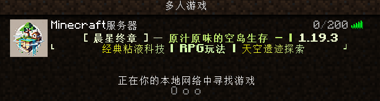
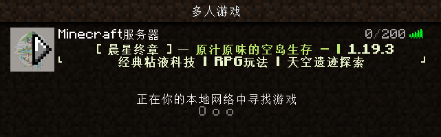
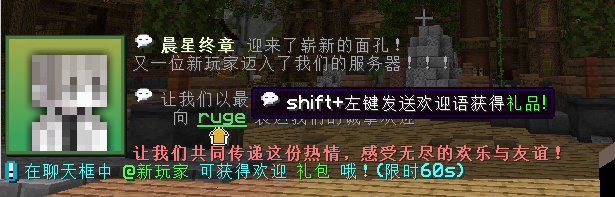

# ServerMotdJoin


## 插件简介

**ServerMotdJoin** 是一款为Minecraft服务器量身定制的增强互动型插件，旨在通过富有互动性和动态效果的消息展示、玩家互动机制、以及个性化新人欢迎系统，为玩家提供一种更具沉浸感的游戏体验。通过精美的MOTD（服务器欢迎信息）和动态的玩家活动通知，不仅能让玩家感受到热烈的欢迎，还能激励更多的互动与合作。

## 主要功能

### 1. 动态MOTD展示
自定义服务器信息显示，使用颜色和样式美化 **MOTD** 信息。
支持多组 **MOTD** 信息,随机展示。

**配置示例：**
```yaml
motd:
  MaxPlayers:
    Enabled: true
    MaxPlayers: 200
  ServerMOTD:
    Enabled: true
    motds:
      0:
        - "&x&e&d&f&8&c&e       [ &l晨星终章 &x&e&d&f&8&c&e] 一 &x&c&0&e&c&6&f&l原汁原味的空岛生存 - | &x&e&d&f&8&c&e&l1.19.3"
        - "┕        经典粘液科技 &l| RPG玩法 &l| 天空遗迹探索        ┙"
      1:
        - "&x&e&d&f&8&c&e       [ &l晨星终章 &x&e&d&f&8&c&e] 一 &x&c&0&e&c&6&f&l原汁原味的空岛生存 - | &x&e&d&f&8&c&e&l1.19.3"
        - "┕        &x&f&b&f&b&0&8经&x&f&4&f&b&2&9典&x&e&c&f&c&4&a粘&x&e&5&f&c&6&b液&x&d&d&f&d&8&c科&x&d&6&f&d&a&d技 &l| RPG玩法 &l| &x&f&b&f&b&0&8天&x&f&4&f&b&2&9空&x&e&c&f&c&4&a遗&x&e&5&f&c&6&b迹&x&d&d&f&d&8&c探&x&d&6&f&d&a&d索        ┙"
```



### 2. 新玩家欢迎系统
当新玩家加入时，系统将自动向全体玩家发送欢迎通知，并鼓励其他玩家主动欢迎新人，同时提供60秒内的互动奖励机制。
配合资源包加载插件可以美化信息。


**配置示例：**
```yaml
#新玩家第一次进服发送给
#全体玩家的信息(除新人)
NotNewJoinPlayers:
  Enabled: true
  messages:
    - "%img_npc-title-5% &f%img_title-21% &x&e&d&f&8&c&e&l晨星终章 &7迎来了崭新的面孔！"
    - "                &7又一位新玩家迈入了我们的服务器！！！"
    - ""
    - "                &f%img_title-21% &7让我们以最热烈的欢迎和最独特的礼仪"
    - "                     &7向 [&x&6&c&d&5&7&3&n%player_name%](insertion=欢迎@%player_name%;hover=&f%img_title-21% shift+左键发送欢迎语获得&a礼品!)&7 表达我们的诚挚欢迎"
    - "                         :offset_2:%img_itemlore-40%"
    - "                &x&f&4&7&d&7&d&l让我们共同传递这份热情，感受无尽的欢乐与友谊！"
  actions:
    - "sound ITEM_GOAT_HORN_SOUND_1 by 20 20"
    - 'tell color inline "{{papi %img_itemlore-3%}} &b在聊天框中 &a@新玩家 &b可获得欢迎 &a礼包 &b哦！(限时60s)"'
#当玩家 @新人输入欢迎用语时执行kether
ChatMention:
  Enabled: true
  #欢迎有效时间 60s 填-1表示没有有效时间
  duration: 60
  #当玩家欢迎新人后执行kether
  #这里你可以使用指令给予玩家奖励
  #或者写分组具体实现看kether文档
  actions:
    - 'tell 欢迎了新人你可太棒了'
```

### 3. 玩家动态
在玩家加入和退出时，系统会实时更新动作条，展示玩家的加入和离开，增加了服务器的互动性和社交氛围。
**配置示例：**
```yaml
#玩家加入时执行kether
playerJoin:
  Enabled: true
  actions:
    - 'actionbar color inline "&a&l[+] {{papi %smj_join%}} 加入了游戏"'

#玩家退出时执行kether
onPlayerQuit:
  Enabled: true
  actions:
    - 'actionbar color inline "&c&l[-] {{papi %smj_quit%}} 悄无声息的离开了"'
```